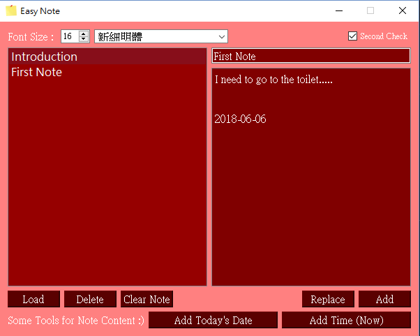

# Python_EasyNote

It's a little application I made using some free time , it's very simple but quite useful.

How to use :
try it yourself!!

Caution :
Please don't edit "note_file.txt" directly , doing so will very likely cause error when loading your notes next time.

If you find any bug when using or you have any suggestions , please comment !

# Important

Please check if your computer has Python 2.7 before using this application!

To hide console window , change the .py file to .pyw file.

# Sample

